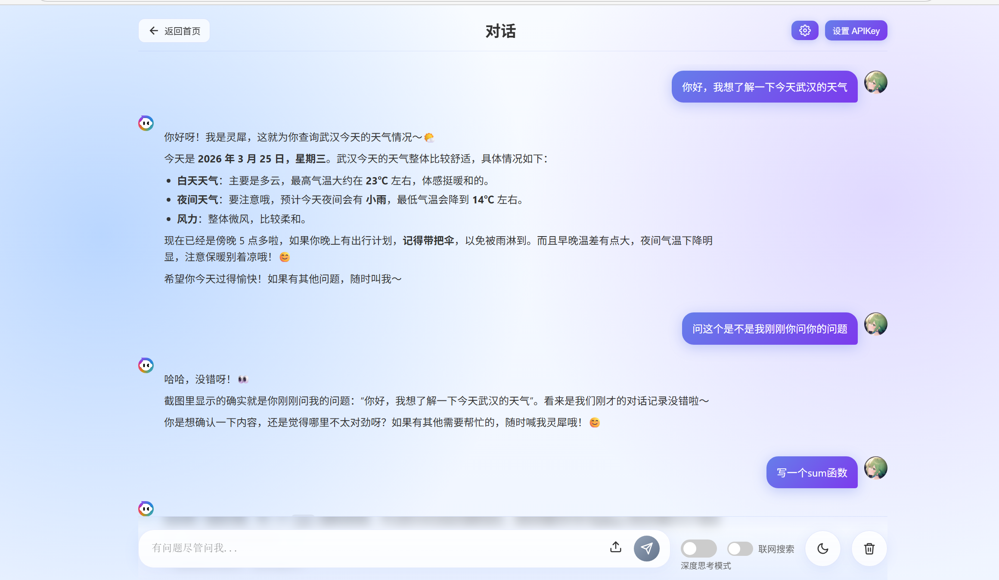

# 灵犀 AI 对话助手 - 项目总结报告

> **姓名**：彭鸿斌\
> **学校**：华中师范大学\
> **学号**：2024124379\
> **技术栈**：原生 JavaScript + HTML5 + CSS3 + 阿里云百炼 API

***

## 一、项目概述

### 1.1 项目名称

**灵犀 AI 对话助手**

### 1.2 项目简介

我独立开发的一款智能对话 Web 应用，基于阿里云百炼大模型 API，实现了流畅的 AI 对话体验。项目采用纯前端技术栈，支持流式响应、深度思考、多模态对话、参数微调等功能。

### 1.3 设计理念

- **用户体验优先**：流式响应、实时反馈、优雅的交互设计
- **功能完整性**：从对话到设置，提供完整的功能闭环
- **代码可维护性**：模块化设计、清晰的代码结构、完善的注释

***

## 二、开发任务索引

### ✅ 已完成的功能清单

#### 2.1 核心对话功能

- **智能对话**：基于阿里云百炼 Qwen3.5-plus 模型的真实对话
- **流式响应**：打字机效果的实时输出体验
- **深度思考模式**：展示 AI 的完整思考过程
- **联网搜索**：支持开启联网搜索获取最新信息
- **多轮对话**：自动保存最近 4 轮对话历史作为上下文
- **多模态对话**：支持图片上传和理解（Base64 方案，因为没有后端存储，后续考虑学了go后端之后结合阿里云OSS实现图片的在线存储，后续就可以根据url实现图片上传了，同时也能够支持上下文存储了）

#### 2.2 用户界面

- **欢迎页面**：精美的欢迎界面和快捷建议卡片
- **对话界面**：清晰的消息展示和输入区域
- **主题切换**：浅色/深色主题完美适配
- **响应式设计**：移动端友好布局

#### 2.3 图片处理

- **图片上传**：支持点击上传和粘贴上传
- **缩略图预览**：显示图片名称、大小，支持移除
- **图片限制**：文件大小限制 10MB，数量限制 1 张
- **消息展示**：用户消息中嵌入图片预览

#### 2.4 参数设置

- **模型参数调节**：
  - Temperature (0-2)：控制回答随机性
  - Top P (0-1)：核采样参数
  - Top K (1-100)：采样词数量
- **联网搜索开关**：一键开启/关闭联网搜索
- **参数持久化**：自动保存到 localStorage，便于下次直接使用此风格的AI回答效果

#### 2.5 辅助功能

- **Markdown 渲染**：支持代码高亮、表格、列表等，查询网上资料使用prism.js实现代码高亮渲染，使用markd.js实现markdown格式的响应解析渲染
- **代码复制**：一键复制代码块
- **Token 统计**：显示每次对话的 Token 消耗，实际就是在请求体中添include\_usage: true就可以获取
- **对话历史**：localStorage 持久化存储，考虑到本地存储的容量限制，我只保存了4轮文本类的上下文对话信息
- **Enter 发送**：Enter 发送、Shift+Enter 换行

#### 2.6 交互优化

- **请求中断**：随时停止 AI 回答
- **防止误触**：AI 响应时屏蔽 Enter 键，防止用户误触导致的上一轮对话中断
- **按钮状态**：发送/停止按钮智能切换

***

## 三、核心技术实现

### 3.1 流式响应处理

#### 实现思路

我使用 `fetch` + `ReadableStream` 实现 SSE（Server-Sent Events）流式读取，让 AI 的回答像打字机一样逐字显示。

#### 关键代码逻辑

```javascript
// 1. 发起流式请求
fetch(`${BASE_URL}/chat/completions`, {
    stream: true,
    signal: abortController.signal
})

// 2. 获取读取器
const reader = response.body.getReader();

// 3. 循环读取数据块
function processChunk({ done, value }) {
    if (done) return; // 传输完成
    
    // 4. 解码二进制数据
    const chunk = new TextDecoder().decode(value);
    
    // 5. 解析 SSE 格式（每行以 "data: " 开头）
    const lines = chunk.split('\n');
    lines.forEach(line => {
        if (line.startsWith('data: ')) {
            const data = line.substring(6);
            const event = JSON.parse(data);
            
            // 6. 提取内容并实时更新 UI
            if (event.choices[0].delta.content) {
                aiResponse += event.choices[0].delta.content;
                // 实时更新界面
            }
        }
    });
    
    // 7. 继续读取下一块
    reader.read().then(processChunk);
}
```

#### 技术亮点

- **ReadableStream**：高效处理流式数据
- **TextDecoder**：二进制转文本
- **SSE 解析**：处理 `data: `     前缀格式
- **实时更新**：减少 DOM 重绘，批量更新

***

### 3.2 深度思考模式

#### 实现思路

qwen3.5-plus 模型会返回两种内容：`reasoning_content`（思考过程）和 `content`（最终回答）。我分别处理这两种内容，让用户既能看到 AI 的"草稿纸"，又能看到最终答案。

#### 关键代码逻辑

```javascript
// 构建请求时开启深度思考
body: JSON.stringify({
    enable_thinking: elements.thinkingToggle.checked,
    // ...其他参数
})

// 解析响应时分别处理
if (choice.delta && choice.delta.reasoning_content) {
    currentReasoning += choice.delta.reasoning_content;
    // 实时更新思考区域（纯文本，不需要 Markdown）
    reasoningContent.textContent = currentReasoning;
}

if (choice.delta && choice.delta.content) {
    aiResponse += choice.delta.content;
    // 更新实际回答（需要 Markdown 渲染）
    actualContent.innerHTML = renderMarkdown(aiResponse);
}
```

#### 用户体验

- **思考过程可见**：用户可以看到 AI 如何一步步推理
- **分离显示**：思考过程在上，实际回答在下
- **实时滚动**：思考内容自动滚动到底部

***

### 3.3 联网搜索功能

#### 实现思路

在请求体中添加 `enable_search` 参数，让大模型可以访问互联网获取最新信息。

#### 关键代码逻辑

```javascript
// HTML 中添加联网搜索开关
<label class="search-toggle">
    <input type="checkbox" id="searchToggle">
    <span class="slider"></span>
    <span class="toggle-text">联网搜索</span>
</label>

// 发送请求时附加参数
body: JSON.stringify({
    enable_search: elements.searchToggle.checked,
    // ...其他参数
})

// 持久化保存
elements.searchToggle.addEventListener('change', () => {
    localStorage.setItem('enable_search', elements.searchToggle.checked);
});
```

***

### 3.4 大模型参数设置

#### 实现思路

我实现了完整的参数调节系统，用户可以通过滑块微调模型输出效果。所有参数实时保存到 localStorage，页面刷新后依然有效。

#### 参数说明

| 参数              | 范围    | 默认值 | 作用             |
| :-------------- | :---- | :-- | :------------- |
| **Temperature** | 0-2   | 1.0 | 控制随机性，值越大回答越多样 |
| **Top P**       | 0-1   | 0.9 | 核采样参数，控制词汇多样性  |
| **Top K**       | 1-100 | 50  | 从概率最高的 K 个词中采样 |

#### 关键代码逻辑

```javascript
// 1. 定义全局参数对象
let modelParams = {
    temperature: 1,
    top_p: 0.9,
    top_k: 50
};

// 2. 从 localStorage 加载
function loadModelParams() {
    const savedParams = localStorage.getItem('model_params');
    if (savedParams) {
        modelParams = JSON.parse(savedParams);
    }
}

// 3. 保存到 localStorage
function saveModelParams() {
    localStorage.setItem('model_params', JSON.stringify(modelParams));
}

// 4. 发送请求时附加参数
body: JSON.stringify({
    temperature: modelParams.temperature,
    top_p: modelParams.top_p,
    extra_body: {
        top_k: modelParams.top_k
    }
})

// 5. 滑块实时更新显示值
elements.temperatureInput.addEventListener('input', (e) => {
    elements.temperatureValue.textContent = parseFloat(e.target.value).toFixed(1);
});
```

#### 用户界面



### 3.5 请求中断机制

#### 实现思路

使用 `AbortController` 实现请求中断，让用户可以随时停止 AI 的回答。同时巧妙处理 Enter 键和发送按钮的逻辑，防止误触。

#### 关键代码逻辑

```javascript
// 1. 创建中止控制器
abortController = new AbortController();

// 2. 传递给 fetch
fetch(url, {
    signal: abortController.signal
})

// 3. 用户点击停止按钮
if (isSendBtnStopping) {
    abortController.abort();  // 立即中断请求
    isStreaming = false;
    restoreSendButton();
}

// 4. Enter 键处理（AI 响应时屏蔽）
if (e.key === 'Enter' && !e.shiftKey) {
    if (isStreaming) return;  // 防止误触中断
    sendMessage();
}
```

#### 设计亮点

- **Enter 键屏蔽**：AI 响应时屏蔽 Enter，防止误触
- **按钮双重角色**：发送按钮在响应时变为"停止"按钮
- **优雅恢复**：中断后自动恢复按钮状态，移除 AI 消息

***

### 3.6 多模态对话（图片理解）

#### 实现思路

使用 `FileReader` 将图片转为 Base64 Data URL，构建多模态消息发送给大模型。

#### 关键代码逻辑

```javascript
// 1. 图片转 Base64
const reader = new FileReader();
reader.onload = function(e) {
    currentImageBase64 = e.target.result;  // Data URL 格式
};
reader.readAsDataURL(file);

// 2. 构建多模态消息
let userMessageContent;
if (imageBase64) {
    userMessageContent = [
        {
            type: 'image_url',
            image_url: { url: imageBase64 }
        }
    ];
    
    // 如果有文本，添加到前面
    if (message) {
        userMessageContent.unshift({
            type: 'text',
            text: message
        });
    }
}

// 3. 发送请求
messages.push({
    role: 'user',
    content: userMessageContent
});
```

#### 用户体验优化

- **粘贴上传**：Ctrl+V 直接粘贴截图
- **缩略图预览**：显示文件名、大小，支持移除
- **数量限制**：一次只能上传 1 张图片
- **大小限制**：图片不超过 10MB

***

### 3.7 对话历史管理

#### 实现思路

使用 localStorage 存储最近 4 轮对话，让 AI 具备多轮对话能力。同时做好异常处理，兼容浏览器的追踪防护机制。

#### 关键代码逻辑

```javascript
// 1. 保存到 localStorage
function addToChatHistory(role, content) {
    const history = getChatHistory();
    history.push({ role, content });
    
    // 只保留最近 4 轮（8 条消息）
    if (history.length > MAX_HISTORY * 2) {
        history.shift();
    }
    
    localStorage.setItem('lingxi_chat_history', JSON.stringify(history));
}

// 2. 读取历史（带异常处理）
function getChatHistory() {
    try {
        const history = localStorage.getItem('lingxi_chat_history');
        return history ? JSON.parse(history) : [];
    } catch (e) {
        console.warn('无法读取对话历史:', e);
        return [];
    }
}

// 3. 构建请求时附加历史
const messages = [{ role: 'system', content: '...' }];
chatHistory.forEach(item => {
    messages.push(item);
});
```

#### 异常处理

- **try-catch 包裹**：所有 localStorage 操作都做了异常捕获
- **降级方案**：如果 localStorage 被阻止，使用空数组

***

## 四、项目亮点总结

### 4.1 技术亮点

1. **流式响应**：使用 ReadableStream 实现打字机效果
2. **双内容处理**：分别处理思考过程和实际回答
3. **参数微调**：完整的模型参数调节系统
4. **请求中断**：AbortController 实现优雅中断
5. **多模态对话**：Base64 方案实现图片理解

### 4.2 用户体验亮点

1. **实时反馈**：流式输出、Token 统计、思考过程可见
2. **防止误触**：AI 响应时屏蔽 Enter 键
3. **持久化**：所有设置自动保存，刷新不丢失

***

## 五、学习收获

通过这个项目，我深入理解了：

1. **Fetch API 和流式处理**：掌握了现代网络请求和流式数据处理技术
2. **AbortController**：学会了如何实现可中断的异步操作
3. **localStorage 应用**：理解了前端数据持久化方案
4. **用户体验设计**：学会了从用户角度思考交互细节
5. **代码架构**：实践了模块化、可维护的代码组织方式

***

**感谢观看！** 🎉

*如有问题或建议，欢迎交流讨论。*
