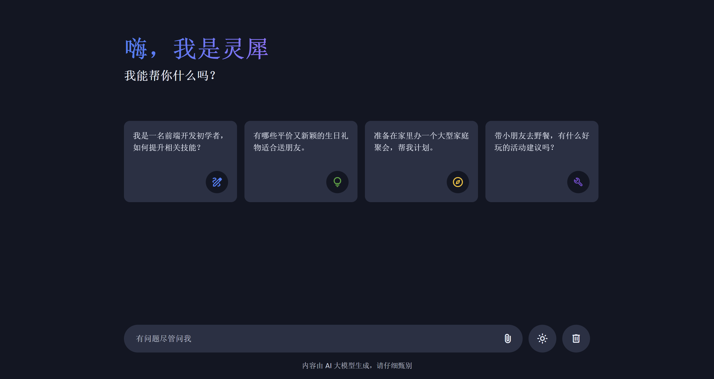
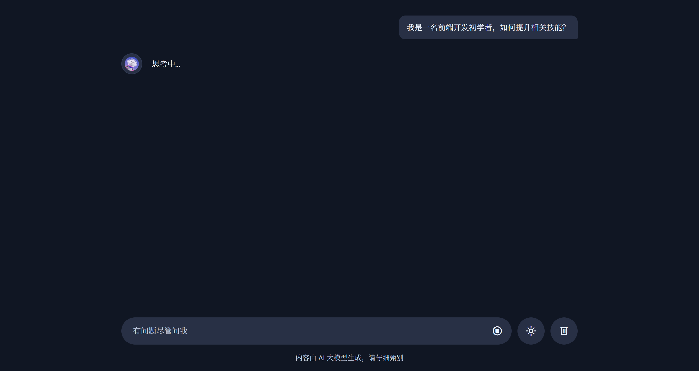
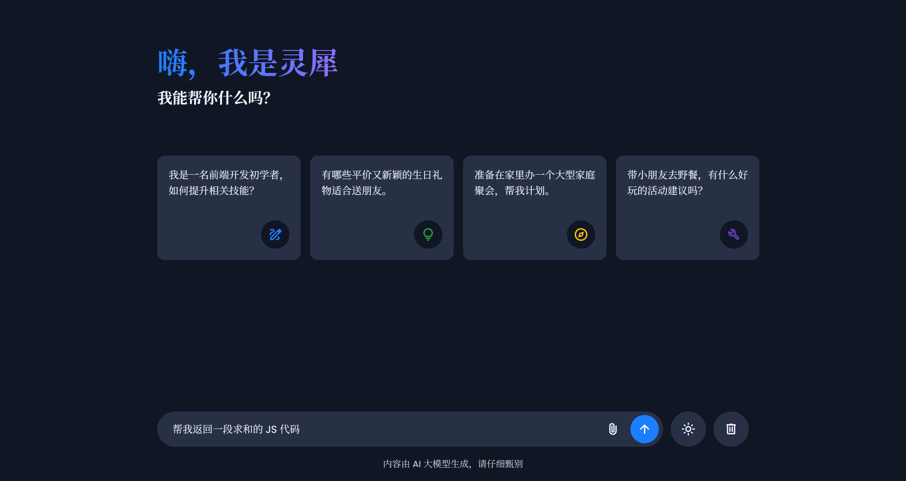
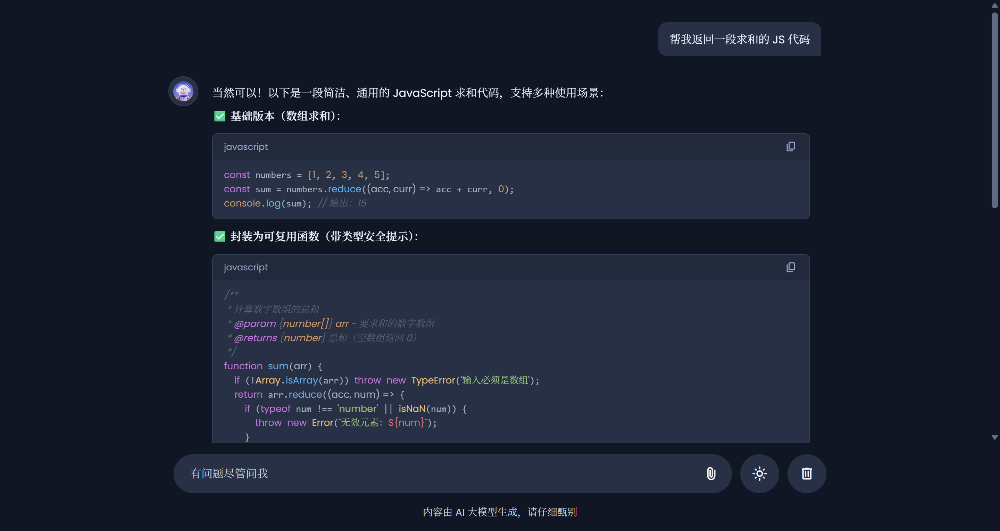

这是一个仿 WPS 灵犀风格的 AI 对话助手，需接入大模型 API，要求统一使用阿里云百炼，实现真实的 AI 对话功能，并具备深色/浅色主题切换、文件上传、流式响应、Markdown 渲染等特性。
技术栈：HTML + CSS（可选 Tailwind CSS） + JavaScript（不要使用 Vue、React 等框架）
二、核心要求
1. 首页

• 页面包含欢迎标题和副标题
• 标题需要有渐变色文字效果
• 下方展示 4 张快捷建议卡片，横向排列，每张卡片带有不同颜色的图标
• 点击卡片能将内容发送给 AI
在点击卡片后，页面变成：

2. 对话功能
这个是对话功能的截图：

• 接入阿里云百炼合适的模型，实现真实的 AI 问答
• 用户消息靠右显示，AI 回复靠左显示（带头像）
• AI 回复需要使用流式输出，并实现打字机效果逐字显示
• 进入对话后首页的欢迎区和卡片需要隐藏
这个是用户敲回车后得到结果截图

3. Markdown 渲染
AI 的回复内容需解析 Markdown 并渲染为 HTML（标题、表格、代码块、列表、引用等都要正常显示）
4. 主题切换
支持深色模式和浅色模式切换，刷新页面后保持当前颜色模式。
5. 底部输入区
• 输入框固定在页面底部
• 有内容时才显示发送按钮
• 支持图片上传功能（图片可预览）
• AI 响应中显示停止按钮，可中断生成
• 有清除全部对话的按钮，点击后回到首页状态
6. 其他细节要求
• 若返回的内容中有代码块，支持语法高亮，右上角有「复制」功能
• 支持键盘快捷键（如 Enter 发送、Shift+Enter 换行）
• AI API Key 需自行申请（新人一般有免费额度），不要提交 API Key，想办法手动存储在本地即可，使用固定名字：LINGXI_API_KEY
这个LINGXI_API_KEY你可以写在一个.env文件中，格式为LINGXI_API_KEY=你的API_KEY,你暂时可以将这个字段设为空，后续我自己补充
• 老师会使用 Live Server 插件进行查看项目，index.html 中引入的资源使用相对路径