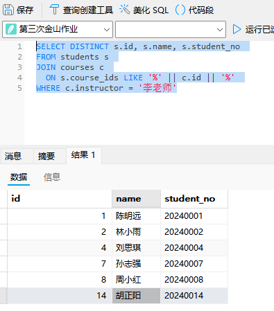
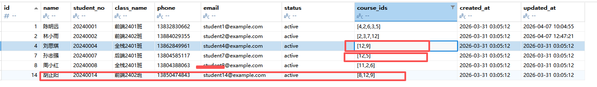
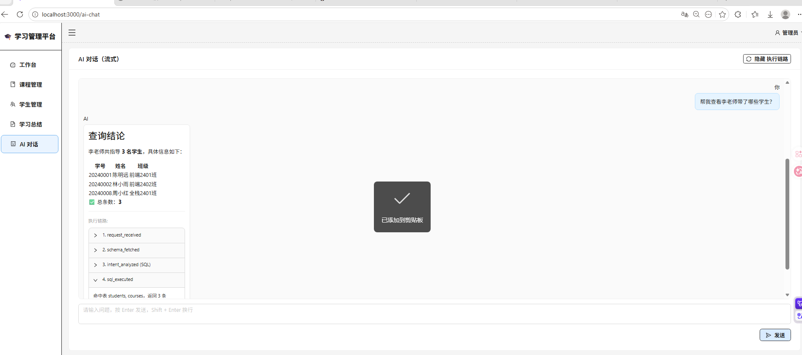

# 第二次作业项目个人总结

本次作业我在完成基础作业功能的前提下，结合第一次大作业的经验和自己的兴趣额外加入了 AI 自然语言查询数据库的能力，用来提升系统的可用性和演示价值。目前可以通过自然语言与AI对话实现课程信息、学生信息的单表查询和复杂的联表查询等操作。

---

## 项目基本信息

- **姓名**：彭鸿斌
- **学校**：华中师范大学
- **学号**：2024124379
- **项目名称**：在线学习管理平台
- **技术栈**：
  - 前端：Vite、React、TypeScript、Ant Design、ECharts、React Markdown
  - 后端：Node.js、Koa、@koa/router、better-sqlite3、jsonwebtoken
  - 扩展能力：大模型对话与意图识别+数据库查询Tool调用实现简单的Agent功能（SSE 流式返回）

---

## 开发任务索引

我按作业文档的 5 个模块逐项完成，并对功能进行了验证：

1. **登录认证**
  - 完成登录页（用户名+密码）
  - 接入后端认证接口
  - 实现未登录访问受保护页面自动跳转登录页
  - 测试账号支持 `admin / admin123`
2. **工作台（Dashboard）**
  - 完成 4 个统计卡片：课程总数、学生总数、发布率、活跃率
  - 完成 4 个图表：
    - 课程选课人数柱状图
    - 近 7 天学习活跃度折线图（学习人数 + 学习时长）
    - 学生状态分布饼图
    - 课程分类分布饼图
3. **课程管理**
  - 课程列表分页（默认 10 条，可调整）
  - 按课程名/讲师搜索
  - 按状态与分类筛选
  - 选课人数列服务端排序
  - 新增、编辑、删除课程
  - 发布/下架状态切换（含确认交互）
4. **学生管理**
  - 学生列表分页（默认 10 条，可调整）
  - 按姓名/学号搜索
  - 按班级和状态筛选
  - 新增、编辑、删除学生
  - 支持多选课程
5. **学习总结**
  - 从服务端获取 Markdown 内容并渲染
  - 支持 Markdown 内图片通过 `/api/static/...` 访问
  - 可直接替换 `server/data/summary.md` 为个人真实总结内容
6. **后端缺失接口补全**
  - 已补齐 `students` 模块的 `POST/PUT/DELETE` 接口
  - 做了学号唯一性校验、数据存在性校验、课程人数联动更新
7. **部署与访问要求**
  - 开发阶段：Vite 代理 `/api` 到 `3000`
  - 生产阶段：`client/dist` 由 Koa 托管，支持 `http://localhost:3000` 访问
8. **扩展功能（非必做）**
  - 新增 AI 对话页面：支持自然语言查询系统数据
  - 支持 SSE 流式输出 + Markdown 渲染 + 执行链路展示

---

## 核心技术实现

这里是我在实现过程中比较关键的技术思路：

### 1) 前后端解耦与请求代理

我在前端统一用 `/api` 前缀调用接口，通过 Vite 代理到后端 `3000`，这样开发和生产的接口路径保持一致，减少环境切换成本。

### 2) 鉴权闭环

登录成功后保存 token，请求拦截器自动注入 `Authorization`。  
路由层做受保护路由校验，401 时统一清 token 并回到登录页，避免页面“假登录”状态。

### 3) 学生与课程数据一致性

学生增删改会影响课程的选课人数，我在后端每次变更后都触发课程人数回写，保证“课程列表排序”和“工作台统计”使用的是一致数据源。

### 4) 工作台数据组织

把统计数据与图表数据在后端一次聚合后返回，前端只负责渲染。  
这种方式可以减少前端拼装逻辑，也便于后续替换图表库或调整展示结构。

### 5) Markdown 总结渲染

学习总结内容由服务端文件维护，前端通过 Markdown 组件渲染。  
图片路径统一映射到静态资源接口，保证内容迁移和部署时不会丢图。

### 6) AI 对话扩展（我的额外实现）

我把 AI 查询做成 SSE 流式接口，前端边接收边展示，体验比“等整段返回”更自然。  
同时保留执行链路（trace），便于定位问题，也方便老师看到这个功能不是“黑盒输出”。

在实现这个功能的时候也遭遇了很多BUG，在设计让AI依据用户问题实现SQL语句生成的时候，这个Prompt需要设计的很细致，比如说，原来我只说明了各个数据库的结构，例如下面这样：  
```json
const prompt = [
    '你是课程管理系统的 SQL 生成助手。',
    '请根据用户问题和数据库表结构，判断是否需要查询数据库来回答。',
    '',
    '如果不需要查询数据库（闲聊、问候、主观评价等），返回：{"needQuery": false}',
    '如果需要查询数据库，返回：{"needQuery": true, "sql": "SELECT ..."}',
    '',
    '约束：',
    '- 只能生成一条 SELECT 语句',
    '- 禁止分号',
    '- 仅能访问 courses、students、learning_records 三张表',
    '- SQL 必须符合 SQLite 语法',
     '数据库表结构：',
    `（1）courses 课程主表
字段名，字段类型，字段含义
id	INTEGER	课程唯一主键 ID，自增整数，全局唯一标识一门课程，用于和其他表做关联
name	TEXT	课程全称，用于前端展示课程名称，如「React 基础入门」
description	TEXT	课程简介/课程描述，说明课程的学习目标、核心内容、适用人群等
instructor	TEXT	课程授课讲师姓名，如「张老师」「李老师」
category	TEXT	课程分类标签，用于课程的归类与筛选，如「前端开发」「后端开发」「数据库」「运维」等
status	TEXT	课程发布状态，枚举值：published（已发布，对学生可见）、draft（草稿，仅后台可见）
student_count	INTEGER	该课程的学习/报名学生总人数，用于统计课程热度
lesson_count	INTEGER	该课程包含的总课时数，标识课程的内容体量
created_at	DATETIME	课程记录的创建时间，即课程信息录入系统的时间
updated_at	DATETIME	课程信息的最后更新时间，课程内容、状态修改时同步更新`,
    `（2）learning_records 学生学习记录表，业务定位：记录学生的课程学习行为数据，是学生与课程的关联中间表，用于统计学习时长、学习轨迹。
字段名	字段类型	字段含义
id	INTEGER	学习记录唯一主键 ID，自增整数，全局唯一标识一条学习行为记录
student_id	INTEGER	学生 ID，关联 students 表的 id 字段，标识该条记录所属的学生
course_id	INTEGER	课程 ID，关联 courses 表的 id 字段，标识学生本次学习的课程
date	TEXT	本次学习的发生日期，格式为 YYYY-MM-DD，用于按日期统计学习行为
duration	INTEGER	本次学习的有效时长，单位为分钟，用于统计学生的学习投入情况`,
    `（3）students 学生信息表：存储平台所有学生的个人基础信息、账号状态、选课情况，是系统的用户核心表。
字段名	字段类型	字段含义
id	INTEGER	学生唯一主键 ID，自增整数，全局唯一标识一名学生，与其他表的 student_id 关联
name	TEXT	学生的真实姓名
student_no	TEXT	学生学号，系统内唯一的学籍编号，如 20240001，用于学籍管理、身份核验
class_name	TEXT	学生所属的班级名称，如「前端 2401 班」「全栈 2401 班」，用于班级维度的学生管理
phone	TEXT	学生的联系手机号，用于账号绑定、通知触达
email	TEXT	学生的邮箱地址，用于账号登录、密码找回、系统通知
status	TEXT	学生状态，枚举值：active（学生比较活跃）、inactive（学生未活跃）
course_ids	TEXT	学生已报名/已选的课程 ID 列表，数组格式存储，关联 courses 表的 id 字段，记录学生的选课情况
created_at	DATETIME	学生账号/信息的创建时间，即学生信息录入系统、账号注册的时间
updated_at	DATETIME	学生信息的最后更新时间，个人信息、选课情况、账号状态修改时同步更新`,
    '',
    '某条实际数据示例：',
    `- courses 表 (${schemaExamples.courses.count}条数据): 字段 ${schemaExamples.courses.fields.join(', ')}, 示例：${JSON.stringify(schemaExamples.courses.example)}`,
    `- students 表 (${schemaExamples.students.count}条数据): 字段 ${schemaExamples.students.fields.join(', ')}, 示例：${JSON.stringify(schemaExamples.students.example)}`,
    `- learning_records 表 (${schemaExamples.learningRecords.count}条数据): 字段 ${schemaExamples.learningRecords.fields.join(', ')}, 示例：${JSON.stringify(schemaExamples.learningRecords.example)}`,
    '',
    `用户问题：${question}`,
  ].join('\n');
```
我发现，当用户询问“帮我查询所有上李老师课程的学生”时，大模型返回的sql语句时是：

```mysql
SELECT DISTINCT s.id, s.name, s.student_no 
FROM students s 
JOIN courses c 
  ON s.course_ids LIKE '%' || c.id || '%' 
WHERE c.instructor = '李老师'
```

**这显然是不对的**，因为比如李老师上了id为2的课程，但是**course_ids字段中可能包含2、或者12的课程**，最终查询结果如下：

---

---

我们结合数据库实际的内容，发现**多查询了**

---

---

因此**后续更改prompt，精细化的说明了students这个表中的重要字段course_ids**，并使用one-shot的提示词编写方法给出了示例，**增加的prompt内容如下**：

```txt
'重要说明 - students.course_ids 字段：',
    '- 字段类型：TEXT，存储 JSON 数组格式的字符串，例如 "[1,2,3]"',
    '- 字段含义：存储学生已选修的所有课程 ID 列表',
    '- 查询方法 1（不推荐，这样会造成歧义，例如查询课程 ID=1 的学生，会模糊匹配到课程id为11的课程）：WHERE course_ids LIKE "%[课程 ID]%" 或 WHERE course_ids LIKE "%课程 ID%"',
    '- 查询方法 2（标准 JSON，推荐）：使用 JSON_EACH(course_ids) 展开，value 即为课程 ID',
    '- 示例：查询选修课程 ID=1 的学生（不推荐） -> SELECT * FROM students WHERE course_ids LIKE "%1%"',
    '- 示例：统计每门课程人数 -> SELECT c.id, c.name, COUNT(*) FROM courses c, students s, JSON_EACH(s.course_ids) WHERE CAST(value AS INTEGER) = c.id GROUP BY c.id',
    '-注意：learning_records 表仅代表学生学习记录，不包含选课关系，真正的选课关系在 students 表的 course_ids 字段',
```

**之后当用户再次询问“帮我查询所有上李老师课程的学生”这个需要联表查询的复杂语句时，生成的sql结果如下：**
```mysql
SELECT s.id, s.name, s.student_no, s.class_name FROM students s JOIN courses c ON c.id IN (SELECT CAST(value AS INTEGER) FROM JSON_EACH(s.course_ids)) WHERE c.instructor = '李老师'
```
**这个是正确的，我们看正确返回结果如下：**

---

---

**这说明李老师带了三名学生，与数据库的真实数据也相符合**

1. **我对这次作业的侧重点**
  - 不只是“把页面做出来”，而是结合AI的发展，新增了基于AI的智能化数据库查询操作，通过自然语言就可以很方便的实现单表和多表联合查询。
2. **我在实现中的取舍**
  - UI 方面我做了贴近作业示意图的还原，但没有引入任何被禁止的脚手架方案；仍保持在题目允许的技术栈范围内。
3. **我认为最有价值的扩展**
  - AI 自然语言查询能力：它让系统从“传统管理台”向“智能交互”迈了一步，也体现了我对大模型工程化落地的尝试。
4. **可继续优化方向**
  - 增加更完善的表单校验规则与错误提示；
  - 增加AI的上下文存储功能，实现多轮对话的话题一致性
  - 目前严格限制大模型仅生成查询SQL语句，后续希望通过权限校验实现增删改的功能
  - 把 AI 查询结果和筛选器联动（例如一键套用查询条件）；
  - 增加接口与关键流程测试用例，提高可维护性。

---

## 运行说明

```bash
# 后端
cd server
npm install
npm run dev

# 前端
cd client
npm install
npm run dev
```

- 开发访问：`http://localhost:5173`
- 生产构建：`cd client && npm run build`
- 生产访问：确保后端已托管 `client/dist`，访问 `http://localhost:3000`

