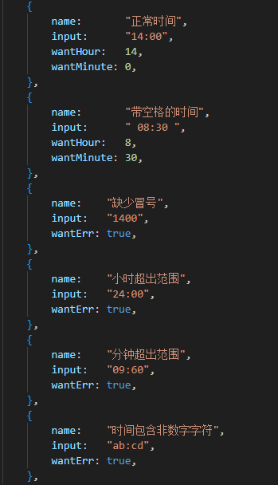
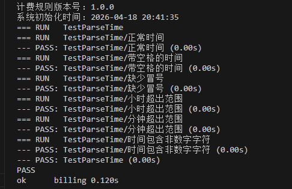
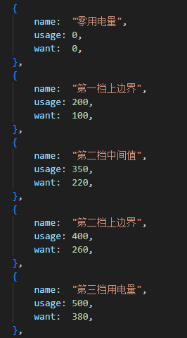
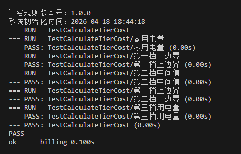
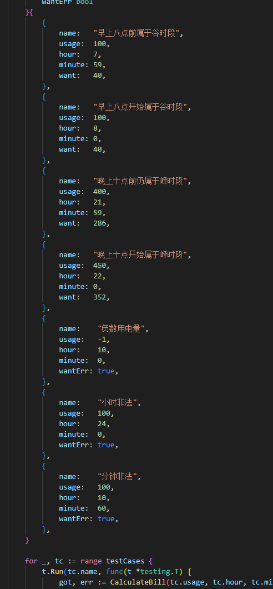
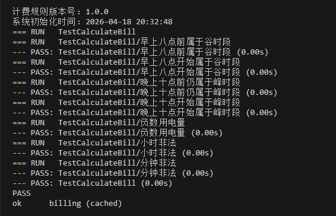
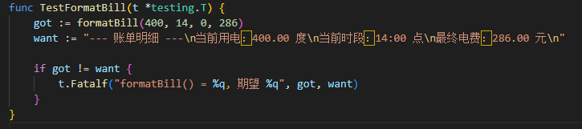
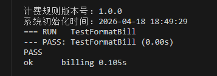

# 智能阶梯计费系统

## 个人信息

- 学校：华中师范大学
- 姓名：彭鸿斌
- 学号：2024124379

## 项目简介

本次作业实现了一个基于 Go 语言编写的智能阶梯计费系统。程序能够根据用户输入的用电量和用电时段，按照阶梯电价规则与峰谷调节规则计算最终电费，并输出账单明细。

## 已完成功能

- 使用 `init()` 函数完成系统初始化，并输出计费规则版本号和系统初始化时间。
- 使用常量定义三档阶梯电价的分界点、各阶梯单价以及峰谷时段倍率。
- 支持读取用户输入的用电量和用电时段。
- 支持对输入的用电量进行合法性校验，避免出现负数用电量。
- 支持对输入的时间字符串进行解析，并校验小时和分钟范围。
- 支持按照三档阶梯规则计算基础电费。
- 支持根据峰时段和谷时段对基础电费进行调整。
- 支持输出格式化后的账单明细。
- 编写了单元测试，对时间解析、阶梯电费计算、最终计费结果和账单格式进行了验证。

## 实现思路

我在实现这个作业时，先把业务逻辑拆成了几个独立的小函数，再由 `main()` 函数统一组织流程。整体思路如下：

1. 程序启动后先执行 `init()`，输出当前计费规则版本号和系统初始化时间。
2. 在 `main()` 中先读取用户输入的用电量，再读取用电时段字符串。
3. 使用 `ParseTime()` 对时间进行解析，把字符串转换为小时和分钟。
4. 使用校验函数判断用电量和时间是否合法。
5. 先通过 `calculateTierCost()` 计算基础阶梯电费。
6. 再通过 `applyTimeFactor()` 根据时段给基础电费乘上峰谷倍率。
7. 最后使用 `formatBill()` 生成账单明细并输出。

这样的拆分方式可以让每个函数只负责一个小任务，也更方便编写单元测试。

## 函数列表及功能说明

| 函数名 | 功能说明 |
| --- | --- |
| `init()` | 初始化系统信息，输出计费规则版本号和系统初始化时间。 |
| `readUserInput()` | 读取用户输入的用电量和用电时段。 |
| `validateUsage()` | 校验用电量是否合法，防止出现负数。 |
| `validateTime()` | 校验小时和分钟是否在有效范围内。 |
| `ParseTime()` | 解析 `HH:MM` 格式的时间字符串。 |
| `calculateTierCost()` | 按阶梯电价规则计算基础电费。 |
| `isPeakTime()` | 判断当前时段是否属于峰时段。 |
| `applyTimeFactor()` | 按峰谷时段规则对基础电费进行调整。 |
| `CalculateBill()` | 综合调用校验、阶梯计费和峰谷调整逻辑，得到最终电费。 |
| `formatBill()` | 将账单信息格式化为题目要求的输出形式。 |
| `main()` | 控制程序整体执行流程。 |

## 单元测试说明

我在 `billing_test.go` 中使用表驱动测试对主要逻辑进行了覆盖，重点测试了以下内容：

- 时间解析是否正确。
- 阶梯电费在边界值下的计算是否正确。
- 峰时段和谷时段在边界时间下的计费是否正确。
- 非法输入是否能够正确返回错误。
- 账单输出格式是否符合预期。

运行测试命令：

```bash
go test ./...
```

## 单元测试截图
**测试时间解析函数的正常与异常场景**
(1) 测试用例截图

(2) 单元测试通过截图


**测试阶梯计费函数的正常与异常场景**
(1) 测试用例截图

(2) 单元测试通过截图


**测试最终计费函数的正常与异常场景**
(1) 测试用例截图

(2) 单元测试通过截图


**测试账单格式化函数的正常与异常场景**
(1) 测试用例截图

(2) 测试用例截图


## 处理“阶梯计费”时遇到的逻辑难点

在完成本次作业时，我主要遇到了下面几个逻辑难点：

1. 用户非法输入的错误处理。  
   例如，在用户输入用电量的时候，你需要校验用户输入的数据是否能够变为浮点数，不能就要在函数内部进行错误的处理，具体我使用这个代码解决：
   ```go
   func readUserInput() (float64, string, error) {
	var usage float64
	fmt.Print("请输入用电量：")
	if _, err := fmt.Scanln(&usage); err != nil {
		return 0, "", fmt.Errorf("读取用电量失败：%w", err)
	}
	var timeText string
	fmt.Print("请输入用电时段（格式 HH:MM）：")
	if _, err := fmt.Scanln(&timeText); err != nil {
		return 0, "", fmt.Errorf("读取用电时段失败：%w", err)
	}
	return usage, strings.TrimSpace(timeText), nil
   }
   ```
   这样在后续的校验和计算中，就可以直接调用 `readUserInput()` 函数，而不需要重复写校验代码。
2. 另一方面，还需要校验用户的输入是否在正常的范围内，比如用电量不能为负数，时间必须在 `00:00` 到 `23:59` 之间等等,值得注意的是，晚上的0点容易误判，因此这里我做了一个巧妙的处理，我只判断小时是否在高峰时段，而分钟则不校验。

3. 峰谷时段的边界处理。  
   题目中要求高峰时段为 `8:00-22:00`，低谷时段为 `22:00-次日8:00`。这里最容易出错的地方就是 `8:00` 和 `22:00` 这两个临界点，后续看老师作业的要求，(22:00-次日8:00]为低谷时段。(8:00-22:00]为高峰时段。

3. 输入解析与校验。  
   用户输入的是字符串形式的时间，不能直接用于计算，所以需要先拆分、再转换、再校验。如果缺少任何一步，都可能导致程序运行错误或者得到错误结果。具体思路是按照 `HH:MM` 格式拆分字符串，再转换为整数，最后校验是否在有效范围内。后面想了下，觉得8：00这种格式也符合人们的日常习惯，所以在校验时，没有将其报告为错误。

4. 代码结构与可测试性。  
   如果把所有逻辑都写在 `main()` 中，代码会比较混乱，也不方便测试。因此我把不同职责的逻辑拆成多个函数，使程序结构更清晰，也更方便定位问题和编写测试。

## 总结

通过这次作业，我进一步练习了 Go 语言中的常量、函数、条件判断、字符串处理、格式化输出以及单元测试等基础内容，也对如何把一个完整的业务规则拆解成多个可维护、可测试的函数有了更直观的理解。
