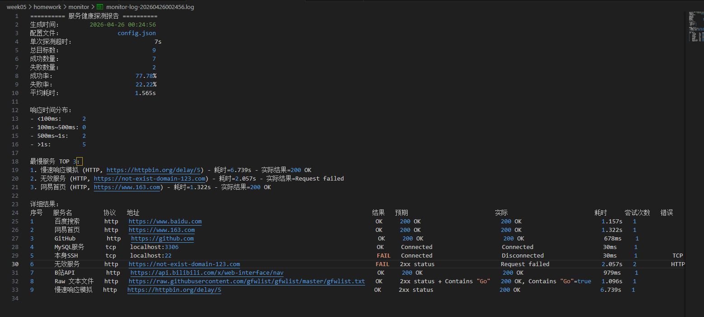
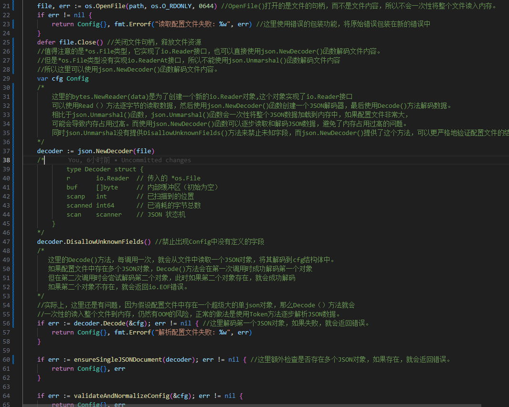
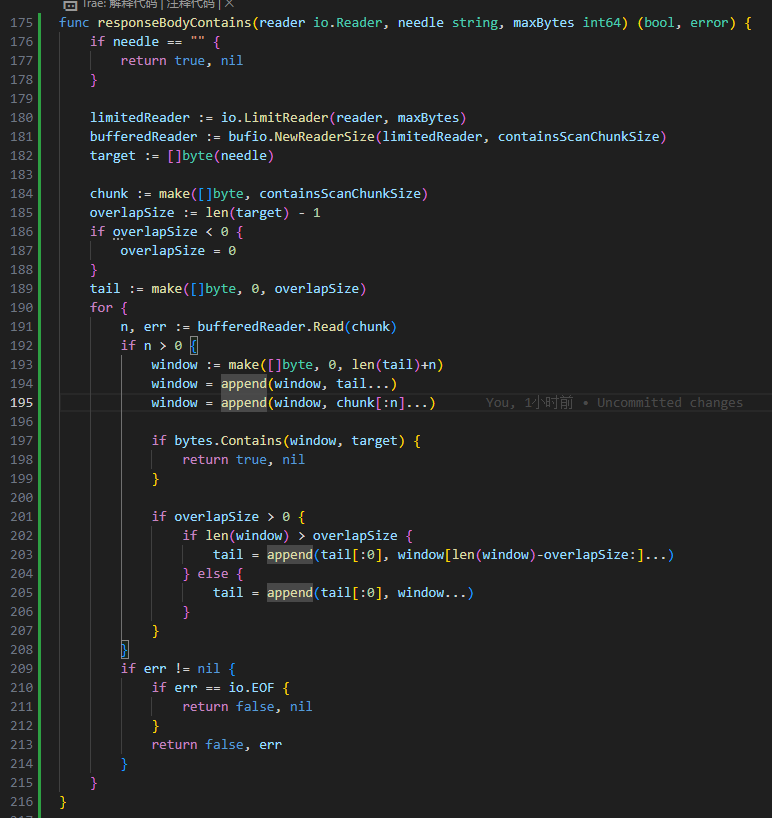
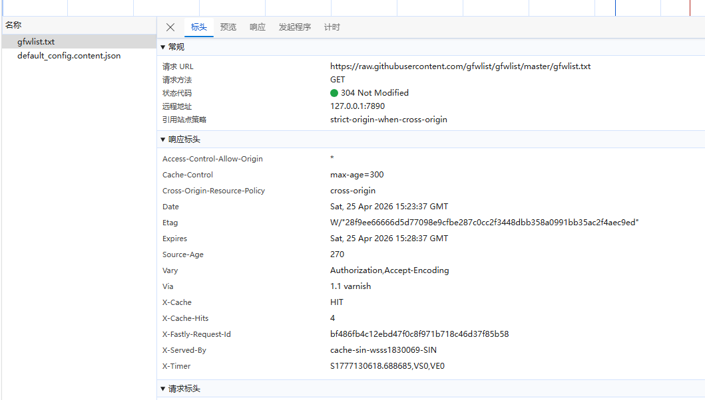
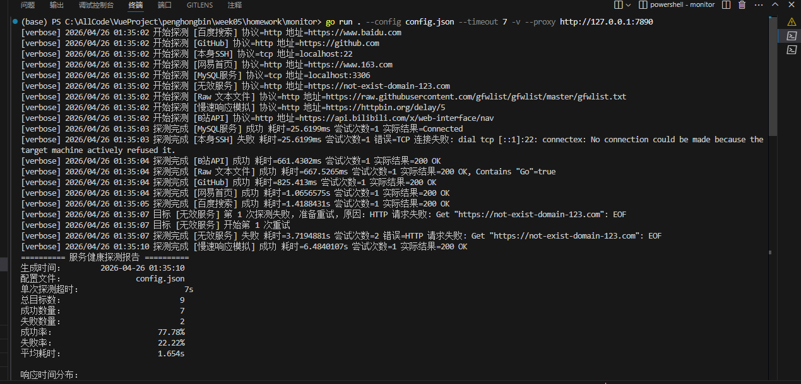
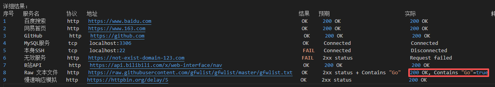

# Week05 课后作业说明

## 个人信息

- 姓名：彭鸿斌
- 学号：2024124379
- 学校：华中师范大学

## 作业内容

本周课后作业是实现一个“服务健康探测器”命令行工具，项目代码放在 `week05/homework/monitor` 目录下。我这次主要完成的是一个支持多目标并发探测的 CLI 程序，能够读取 `config.json` 中的探测目标，对 HTTP 和 TCP 服务进行健康检查，并在探测结束后生成一份汇总报告。

## 我完成的功能

目前我已经完成的功能如下：

- 支持从 `config.json` 中读取多个探测目标
- 支持两类探测协议：
  - `http`
  - `tcp`
- 支持 HTTP 状态码校验
- 支持 HTTP 响应体关键字校验，例如判断响应内容中是否包含 `"Go"`
- 支持 TCP 端口连通性检测
- 支持 `retry_count` 重试机制，失败后会按配置进行重试
- 支持并发启动所有探测任务
- 支持单个任务超时控制，避免某一个目标阻塞整个程序
- 支持 `--config`、`--timeout`、`-v` 命令行参数
- 支持新增的 `--proxy` 参数，在需要时让 HTTP/HTTPS 请求走代理
- 支持生成终端汇总报告
- 支持生成日志文件，文件名格式为 `monitor-log-时间戳.log`
- 补充了单元测试，覆盖了配置读取、HTTP/TCP 探测、重试逻辑、命令行参数解析等核心逻辑

## 项目使用方法

### 1. 进入项目目录

```bash
cd week05/homework/monitor
```

### 2. 直接运行

```bash
go run . --config config.json --timeout 7 -v
```

参数说明：

- `--config`
  指定配置文件路径，默认值是 `config.json`
- `--timeout`
  指定单次探测超时时间，单位为秒
- `-v`
  开启详细模式，实时打印每个目标的探测状态
- `--proxy`
  可选参数，用于指定代理地址，例如：

```bash
go run . --config config.json --timeout 7 -v --proxy http://127.0.0.1:7890
```

### 3. 运行测试

```bash
go test ./...
```

### 4. 运行结果

程序运行后会输出两部分内容：

- 终端中的探测汇总报告
- 当前目录下生成一份日志文件，例如：

```text
monitor-log-20260426002456.log
```



## 项目设计思路

这次实现这个项目时，我主要是按“配置解析 -> 并发探测 -> 结果汇总 -> 报告输出”这个流程来设计的。

### 1. 配置解析

我先实现了配置读取逻辑，从 `config.json` 中解析所有目标，并在读取后做了一些校验和规范化处理，例如：

- 名称不能为空
- 协议只能是 `http` 或 `tcp`
- HTTP 地址必须是合法 URL
- TCP 地址必须是 `host:port`
- `retry_count` 必须在合理范围内
具体的校验逻辑在 `config.go` 中实现，这样可以尽量把错误拦截在程序启动阶段，而不是等到探测过程中才暴露出来。
同时，我还在这里做了一个小优化，就是为了防止config.json文件大小过大导致的内存溢出问题，我使用了os.OpenFile来打开文件，而不是直接读取文件内容。
这样做的好处是：
- 只在需要时才读取文件内容，避免了大文件的内存占用
后面使用json的json.NewDecoder来解析文件内容，这样就可以避免一次性读取整个文件内容，从而减少内存占用。而是每次调用Decode方法，就会从文件中读取下一个JSON对象。避免了大文件导致的内存溢出问题。核心优化内容如下图：




### 2. 并发探测

探测器的核心是并发。我在 `monitor.go` 中使用 goroutine 和 `sync.WaitGroup` 同时启动所有任务，再通过 channel 回收结果。这样做的好处是：

- 所有目标几乎同时开始探测
- 单个目标慢，不会影响其他目标的启动
- 更符合题目中“瞬间扫描所有目标”的要求

同时，为了体现并发效果，我在任务里加入了 `1s` 的人为延迟，但因为任务是并发启动的，所以总耗时不会线性叠加。

### 3. 超时与重试

在探测过程中，我重点考虑了“不能因为一个目标卡住整个程序”这个问题。

- 对 HTTP 探测，我使用 `context.WithTimeout` 和 `http.Client.Timeout` 来控制总超时
- 对 TCP 探测，我使用 `net.Dialer` 的超时控制
- 对需要重试的目标，我将总尝试次数定义为 `retry_count + 1`

也就是说，`retry_count` 表示“失败后额外重试多少次”，而不是总共执行多少次。

### 4. HTTP 探测逻辑

HTTP 探测部分我后来做了一次比较重要的调整。

一开始的实现是直接把整个响应体读入内存，然后再判断是否包含目标字符串。这样在面对较大的文本响应时，很容易出现两个问题：
- 响应体很大时读取耗时过长
- 明明服务是可用的，却因为读取过程超时而被误判为失败
直接把整个 response body 一次性读入内存，再去判断是否包含目标字符串。这样虽然逻辑上简单，但在面对较大的文本响应或较慢的网络环境时，会放大超时风险，使探测结果偏严格，不够符合“健康探测”的实际需求。
后来我把逻辑改成了：

- 如果只检查状态码，就不去主动读取整个响应体
- 如果需要检查 `contains`，就对响应体做流式扫描
- 一旦找到目标字符串就提前返回，不再继续读完整个body
具体的实现逻辑在 `http.go` 中，我使用了 `io.Reader` 接口来读取响应体，而不是直接读入内存。如下图：



这样更符合“健康探测”的目标，也比最开始的实现更合理。

### 5. 报告输出

探测结束后，我会把结果做一次汇总，包括：

- 总目标数
- 成功数量
- 失败数量
- 成功率 / 失败率
- 平均耗时
- 响应时间分布
- 最慢服务 TOP 3
- 详细结果列表

最后再同时输出到终端和日志文件中，方便查看和保存结果。


## 这次开发中我遇到的问题

这次作业里，我觉得最典型的一个问题就是代理相关的问题。

### 问题现象

在测试 `Raw 文本文件` 这个目标时，我发现：

- 浏览器里访问 `https://raw.githubusercontent.com/gfwlist/gfwlist/master/gfwlist.txt` 是成功的
- 但是程序运行时，这个目标有时会超时失败

浏览器访问成功的请求体如下：



刚开始我以为是响应体太大导致的，但后面排查后发现问题并不完全是这个。

### 排查过程

我查看了浏览器中的网络请求，发现浏览器访问这个地址时：

- 实际走了本地代理
- 还带有缓存相关信息
- 有时候返回的是 `304 Not Modified`


而我自己的 Go 程序则是：

- 默认不走浏览器的代理链路
- 严格受 `timeout` 限制

这样一来，就会出现“浏览器能打开，但程序超时失败”的情况。核心原因是没有走网络代理，导致请求被阻塞。

### 我的解决思路

我最后的思路是把“代理”看成运行环境参数，而不是目标配置本身。

所以我没有把 `proxy` 写进 `config.json`，而是选择：

- 给程序增加一个新的命令行参数 `--proxy`
- 在创建 HTTP 客户端时，把这个代理配置接入 `http.Transport.Proxy`
- 当不传 `--proxy` 时，程序保持默认行为
- 当传入 `--proxy` 时，HTTP/HTTPS 请求走指定代理

例如：

```bash
go run . --config config.json --timeout 7 -v --proxy http://127.0.0.1:7890
```
下面是在终端运行这个命令的截图：



最终成功在 `Raw 文本文件` 这个目标上读取到了“Go”这个字符串，截图如下：




我这样设计的原因是：

- `config.json` 更适合描述“探测目标”
- `proxy` 更适合描述“运行环境”
- 不同机器、不同网络下代理可能不同，不适合绑定在目标配置里
我觉得这个改法既解决了实际问题，也让整个项目结构更清晰。

## 我对这次作业的总结

通过这次作业，我对下面这些内容有了更实际的理解：

- Go 中如何做并发任务调度
- `context` 在超时控制中的作用
- `http.Client`、`Transport`、`Dialer` 各自负责什么
- 为什么健康探测不只是“能不能发请求”，还要考虑超时、重试和结果汇总
- 在真实网络环境里，浏览器成功并不等于程序请求一定成功，要注意网络代理的影响

这次实现里我还专门补了测试，用来验证核心逻辑，尽量保证修改功能时不会把原来的行为破坏掉。整体做下来，我觉得这个项目比单纯写一个请求脚本更像一个真正的小型工程练习。
同时，我后续还考虑到，如果congig.json的文件需要探测的目标过多，就会让程序同时发起过多的请求，就是创建过多的并发任务。这样会导致程序在运行时占用过多的系统资源，影响性能。
