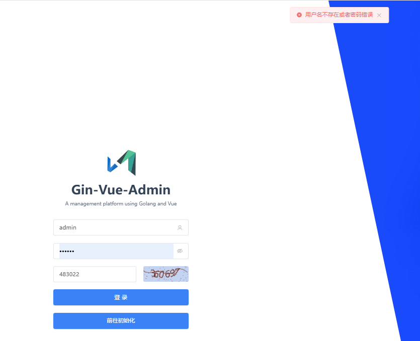
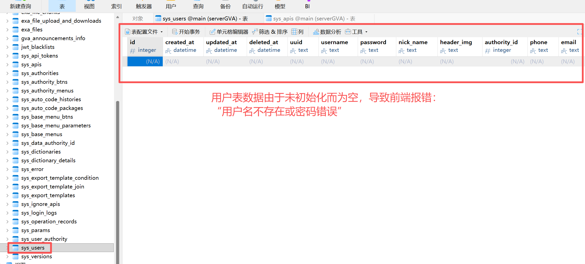

# SQLite 初始化 DSN 路径不一致导致重启后登录失败

## 问题描述

使用 SQLite 数据库初始化项目后，终止后端进程再次启动，登录时提示"用户名或密码错误"。

## 复现步骤

1. 启动后端，访问 `/init` 进行初始化
2. 选择 SQLite 数据库类型
3. `dbPath` 字段**留空**（前端默认值），只填写 `dbName`（如 `gva`）
4. 完成初始化，登录成功
5. **终止后端进程，重新启动**
6. 使用相同账号密码登录 → 提示"用户名不存在或者密码错误"

## 根因分析

### 初始化阶段和重启阶段 DSN 不一致

**初始化时**的 DSN 生成（[`server/model/system/request/sys_init.go:48`](./server/model/system/request/sys_init.go#L48)）：

```go
func (i *InitDB) SqliteEmptyDsn() string {
    separator := string(os.PathSeparator)
    return i.DBPath + separator + i.DBName + ".db"
}
```

当 `dbPath` 为空字符串时，拼接结果为：
- Windows: `\gva.db` → 当前盘符根目录（如 `C:\gva.db`）
- Linux: `/gva.db` → 系统根目录

**重启时**后端程序会读入`server/config.yaml`中的sqlite.path,DSN 生成代码（[`server/config/gorm_sqlite.go:12`](./server/config/gorm_sqlite.go#L12)）：

```go
func (s *Sqlite) Dsn() string {
    return filepath.Join(s.Path, s.Dbname+".db")
}
```

当 `Path` 为空时，`filepath.Join("", "gva.db")` = `gva.db` → **当前工作目录**

### config.yaml 写回结果

初始化完成后，`WriteConfig` 将空的 `dbPath` 写回 `server/config.yaml`：

```yaml
sqlite:
    path: ""        # 空！
    db-name: "gva"
```
这就导致了当使用前端页面进行初始化数据库时，实际sqlite数据库文件路径与从下一次重启服务时，从 `config.yaml` 读取的路径不一致：
| 阶段 | DSN 值 | 实际文件位置 |
|------|--------|--------------|
| 初始化 | `\gva.db` | `C:\gva.db`（盘符根目录） |
| 重启后 | `gva.db` | `server\gva.db`（当前工作目录） |

**两次打开的是不同的文件！** 重启后打开的是一个没有用户数据的全新空数据库。
导致首次通过前端浏览器访问初始化界面并选择 SQLite，当你的 `dbPath` 字段留空时，初始化的数据库文件路径为 `C:\gva.db`
而下次服务重启后由于 `config.yaml` 中的 `sqlite.path` 为空，导致 DSN 值为 `gva.db`，从而打开的是 `server\gva.db`。
这就导致了重启后登录失败的问题。其根本原因是第一次数据库初始化和第二次重启服务得到的数据库文件路径不一致。





## 影响范围

- 仅影响 SQLite 数据库初始化场景
- 仅影响 `dbPath` 字段留空的初始化方式
- MySQL/PostgreSQL 不受影响（它们的 DSN 包含完整的 host/port）

## 修复方案

修改 `server/model/system/request/sys_init.go` 的 `SqliteEmptyDsn` 方法（第一次初始化数据库时）：

```go
func (i *InitDB) SqliteEmptyDsn() string {
    return filepath.Join(i.DBPath, i.DBName+".db")
}
```

与 `server/config/gorm_sqlite.go` 的 `Dsn()` 方法保持一致（重启服务读入`config.yaml`中的sqlite.path路径时）：

```go
func (s *Sqlite) Dsn() string {
    return filepath.Join(s.Path, s.Dbname+".db")
}
```

这样，当在前端页面首次初始化SQlite数据库时，`dbPath` 为空字符串时，`SqliteEmptyDsn（）`方法也会返回`gva.db`路径。与重启时的`Dsn()`方法返回路径保持一致为`gva.db`。
成功解决重启后登录失败的Bug。
## 记录时间

2026-04-30
